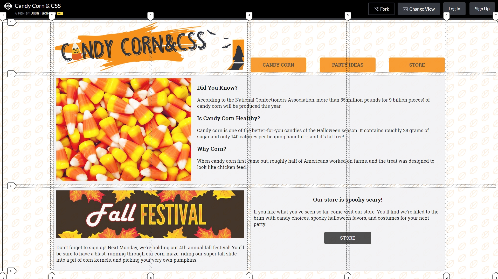

# CSS Grid and Flexbox Exercise

This exercise can be used to teach modern CSS to define a layout for a given site.

**Setup**

1. Remove the CSS that follows the `START HERE` comment.

**Goal**

The goal is to develop a layout using CSS, specifically CSS Grid and Flexbox, that mirrors the layout shown in the included image.

**Directions**

1. Teach the concept of CSS Grid using `grid-template-area` and `grid-area`. Demonstrate how the grid can be drawn in the CSS.
2. Iterate through the layout addressing subsections tweaking various pieces, like navigation, main content, and store.
3. Address minor details last after the layout has been established.