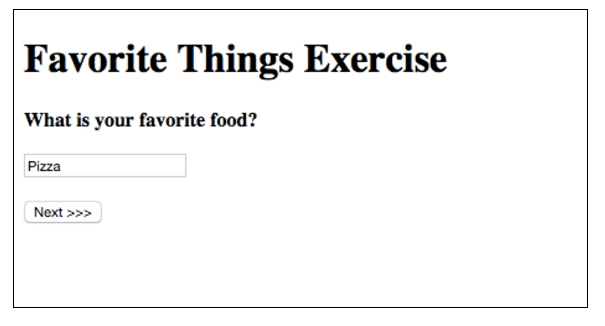

# Favorite Things Survey

In this exercise, your application should ask the user a series of questions and store each answer in the HTTP session. You should use `ModelMap` and the `@SessionAttribute` annotation in the controller.

A controller called `FavoriteThingsController` has already been created for you. This is where you should add information submitted by the user to the session. Additionally, you have been provided the first JSP page called `page1.jsp` as a starting point.

After asking the user all of the questions, you'll display the answers they provided on a summary page.

## Page 1

The user sees the first page at **FavoriteThings/Page1**.

## Page 2

The user sees the second page at **FavoriteThings/Page2**.

## Page 3

The user sees the third page at **FavoriteThings/Page3**.

## Confirm

The user sees the last page at **FavoriteThings/Summary**.

# Hints

* You'll need to create a FavoriteThings model that holds the answers to all of the possible questions that the user fills out.

* You'll need to use Session to store the in-progress status of the favorite things survey.

* Remember to use the [Post-Redirect-Get (PRG) pattern][post-redirect-get pattern] to navigate from one page to another.

[post-redirect-get pattern]: https://en.wikipedia.org/wiki/Post/Redirect/Get