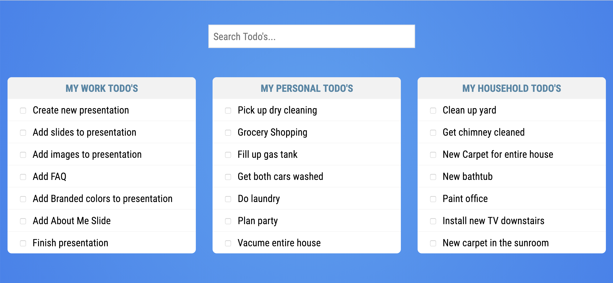
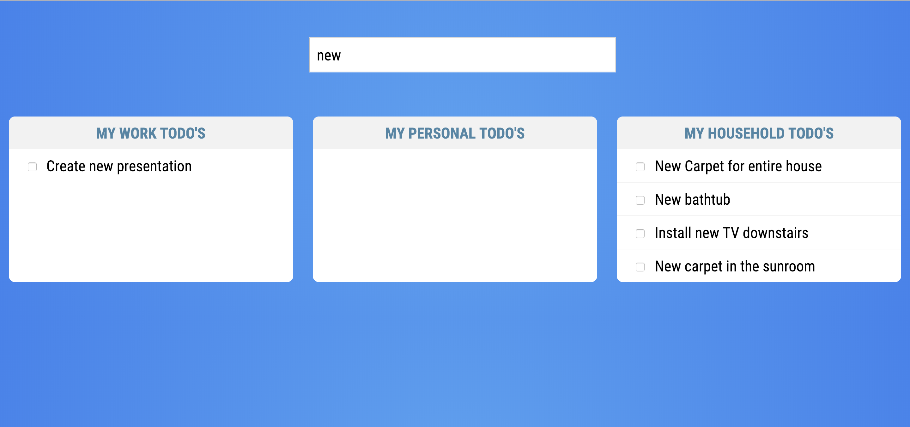

# Vue Nested Components Tutorial

In this tutorial, you'll enhance the todo application. You'll use that Todo List Component to create three separate lists and then create a search component that notifies each of the lists what the user is searching for. This is a great introduction to learning how components communicate with each other. The todo application starter code is located in the `todo-lists` folder inside of this directory.

## Project Starter Code

If you run the starter code for this tutorial, you should see something that looks similar to this.



You'll start with the search component and learn how to communicate with your Todo List components.

## Search Component

As the user starts typing, you want to capture that input. To do this, listen for the `keyup` event on the search input. You can do so by using `v-on:keyup` or the shorthand `@keyup`:

```html
<input type="text" id="search" name="search" v-on:keyup="filterTasks" placeholder="Search Todo's..."/>
```

The string inside of the event is the function that is called when this event is triggered. When the function is called, you get get the value of the search box. Now that you have the value of what the user is searching for, you need to communicate that value to each of the list components. The way that you do this is by emitting a custom event. 

Take that value and emit a new custom event called `filter-tasks`:

```javascript
filterTasks() {
    const query = document.getElementById('search').value;
    this.$emit('filter-tasks', query);
}
```

The first argument of the `$emit` method is the name of the event, and the second is the data you wish to pass along with it. From the search component's standpoint, that's all you need to do.

## App.vue

Now that your search component works, you need to listen for the custom event it now emits. You can use the same approach you used to listen for the built-in `keyup` event for your custom event. On your `todo-search` component, listen for the `filter-tasks` event:

```html
<todo-search v-on:filter-tasks="handleSearch"></todo-search>
```

When the `filter-tasks` event is emitted, the `handleSearch` method is called and passed the search query. You need to create that method and accept the query as an argument. You need to create a new variable in the `data()` function's return object to hold the search term.

``` javascript
data() {
    return {
      search: '',
      work: [],
      personal: [],
      household: []
    }
},
methods: {
    handleSearch(query) {
        console.log('Filter Tasks: ', query);
        this.search = query;
    }
}
```

The reason you do this is because you can now use data binding on your list components. This way, anytime that value is changed, your lists update. You do this by adding the `v-bind:search` directive or shorthand `:search`.

```html
<todo-list title="My Work Todo's" v-bind:todos="work" v-bind:search="search" ></todo-list>
<todo-list title="My Personal Todo's" v-bind:todos="personal" v-bind:search="search" ></todo-list>
<todo-list title="My Household Todo's" v-bind:todos="household" v-bind:search="search" ></todo-list>
```

The value `v-bind:search` is the name of the prop in the `TodoList` component. The value inside of the quotation marks is the variable you're binding to. These don't need to be the same name, but in most cases, it simplifies things and makes it easier to read if they are.

## TodoList Component

Now that your search component is emitting a custom event, you are listening for that event and then passing the search query to your list component all that is left to do is filter the data.

Right now, you're using data binding to pass in the array of data for each list using `:todos="work"`, `:todos="personal"`, and `:todos="household"`. Then in your `TodoList` component, you loop over the todos and display them.

```html
<li v-for="todo in todos"
    v-bind:key="todo.id"
    v-bind:class="{'todo-completed': todo.completed}"
    v-on:click="changeStatus(todo.id, $event)">
    <input type="checkbox"/>
    {{todo.task}} <i class="far fa-check-circle" v-bind:class="{completed: todo.completed}"></i>
</li>
```

## Computed Properties

Now that the user's search term is getting passed to your TodoList component, how can you filter your lists? As you learned in an earlier lesson, computed properties are a great solution to this problem.

Computed properties are a great way to manipulate data that already exists. In your case, you already have an array of tasks and you want to filter out items that don't match the search term. If you're building something, and you need to sort through a large group of data, but you don't want to rerun those calculations on every keystroke, consider using a computed value.

The first thing you need to do is create your computed property. You'll use a Regular Expression so you don't have to worry about comparing case, and then use the [filter](https://developer.mozilla.org/en-US/docs/Web/JavaScript/Reference/Global_Objects/Array/filter) method, which creates a new array with all of the elements that pass your function test.

```javascript
computed: {
    filteredTasks() {
        const filter = new RegExp(this.search,'i');
        return this.todos.filter(todo => todo.task.match(filter));
    }
}
```

Instead of looping over the todos array in your `v-for` directive, you can loop over the `filteredTasks` computed property.

```html
<li v-for="todo in filteredTasks"
    v-bind:key="todo.id"
    v-bind:class="{'todo-completed': todo.completed}"
    v-on:click="changeStatus(todo.id, $event)">
    <input type="checkbox"/>
    {{todo.task}} <i class="far fa-check-circle" v-bind:class="{completed: todo.completed}"></i>
</li>
```

You end up with the same filtered lists, but you get there with a better solution. This is due to computed properties caching results when data doesn't change. To learn more about this, read the [Vue Documentation](https://vuejs.org/v2/guide/computed.html).


